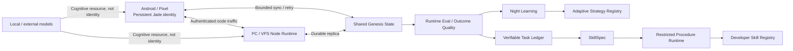

# Jade Genesis

Jade Genesis is an experimental personal AI architecture built around one persistent logical identity that can operate across Android, PC and VPS nodes.

The project is **not** designed around a single permanent LLM as Jade's identity or central brain. Local and external language/vision models are intended to remain interchangeable cognitive resources. The long-term goal is for Jade to accumulate structured experience, evaluate outcomes, consolidate useful evidence and progressively retain reusable strategies and skills under explicit safety boundaries.

> Current Android product version on this branch: **0.1.20** (`versionCode 37`)
>
> Current dependency-free Node Runtime version: **0.1.7** / protocol `jade-genesis-node/0.0.6`
>
> Status: **experimental / personal research project**. Jade can now execute approved deterministic procedures, but it does not yet autonomously synthesize and promote model-generated skills.

## What exists today

The repository contains working foundations for:

- persistent Jade identity on Android;
- local structured memory, device profiling and self-model state;
- authenticated distributed Node Runtime for PC/VPS;
- bounded task routing and cognitive brain profiles;
- Shared Genesis State replication with offline/retry behavior;
- Runtime Evaluation and Outcome Quality signals;
- VPS-supervised Night Cycle / Night Learning;
- a persistent Adaptive Strategy Registry;
- a Verifiable Task Ledger with TRAIN, VALIDATION and hidden `SEALED_TEST` partitions;
- `SkillSpec v1`, a bounded declarative skill contract;
- a restricted deterministic `JADE_PROCEDURE_DSL_V1` interpreter;
- a persistent developer-only Skill Registry with exact task-family selection;
- a single-use aggregate sealed final-exam path for deterministic skills;
- GitHub Actions that compile/test Android and validate the Node Runtime.

## Important limits in 0.1.20

Jade 0.1.20 must not be confused with autonomous general learning.

- only `DEVELOPER`-authored SkillSpecs are executable;
- `EXTERNAL_TEACHER` and future generated SkillSpecs remain non-executable;
- Skill-to-Skill dependencies are disabled;
- there is no arbitrary Python, shell, process, filesystem, network, environment, clock or randomness primitive in the procedure DSL;
- procedure execution is bounded by deterministic step/cost/value/output limits;
- the Procedure Runtime is **not** exposed as an arbitrary remote task;
- Skill Registry registration/activation is not automatic and activation requires explicit approval;
- adaptive strategies still cannot automatically rewrite production code or mutate model weights;
- the restricted interpreter is an in-process interpreter, **not** an OS/container security sandbox for hostile native code;
- autonomous gap detection, synthesis, promotion and broad recall are planned for later milestones.

## Repository layout

```text
Jade-genesis/
├── android/                 Native Android / Pixel application (Kotlin + Compose)
├── node-agent/              Dependency-free Python runtime for PC/VPS nodes
├── docs/                    Versioned architecture and learning-substrate notes
├── .github/workflows/       Android and Node Runtime verification workflows
├── .gitignore
└── README.md
```

The Git repository is the canonical source of truth. Generated archives, APKs and CI logs belong in GitHub Actions artifacts or releases rather than beside current source files.

## Architecture at a glance



Detailed architecture: [`docs/ARCHITECTURE_OVERVIEW.md`](docs/ARCHITECTURE_OVERVIEW.md).

## Learning trajectory

The learning-related stack deliberately separates evidence, governance, executable capability and future autonomous acquisition:

```text
experience
  -> outcome
  -> runtime evaluation
  -> night consolidation
  -> bounded strategy candidate
  -> durable adaptive registry
  -> verifiable task evidence
  -> SkillSpec
  -> restricted deterministic execution       [0.1.20]
  -> developer-approved registry/reuse         [0.1.20]
  -> frozen candidate + sealed final exam      [0.1.20 substrate]
  -> autonomous synthesis/promotion/recall     [future 0.1.21+]
```

The first convincing autonomous-learning proof must require Jade to acquire a capability whose final SkillSpec body was not written by the developer, survive restart, retrieve that retained skill for a new matching task and execute it successfully without asking the teaching LLM to solve the task again.

### SEALED_TEST anti-oracle boundary

`SEALED_TEST` is treated as a final examination rather than iterative training feedback.

In 0.1.20:

- individual sealed cases cannot be queried through the normal case evaluator;
- the hidden set is committed with a private random nonce;
- a frozen SkillSpec must reference the exact sealed-set commitment;
- the final exam executes the whole sealed set internally;
- public feedback is aggregate `PASS/FAIL` only;
- the first candidate consumes that sealed dataset;
- a different candidate cannot retry against the same consumed hidden set;
- replaying the exact same frozen spec is idempotent and does not rerun the hidden cases.

The hidden cases still live in the local ledger state file, so future 0.1.21 synthesis must preserve a strict process/access boundary between the teacher/generator and the verifier-owned ledger.

## Restricted Procedure Runtime — 0.1.20

`node-agent/procedure_runtime.py` interprets only normalized `JADE_PROCEDURE_DSL_V1` ASTs. The language is intentionally small and deterministic: bounded JSON input/literals, object/array construction, field/index access, basic string transformations, arithmetic, comparisons, boolean operators and conditional execution.

There are no loop, recursion, import, dynamic-code, shell, process, filesystem or network primitives. Skill-to-Skill dependencies are rejected in this milestone.

Execution reports deterministic resource accounting (`steps`, `cost_units`) and fails closed on invalid types, missing values, division/modulo by zero, non-finite numbers or resource-limit violations.

See [`docs/RESTRICTED_PROCEDURE_RUNTIME_0.1.20.md`](docs/RESTRICTED_PROCEDURE_RUNTIME_0.1.20.md).

## Skill Registry — 0.1.20

The restricted Skill Registry persists approved developer procedures and proves the causal path:

```text
SkillSpec
-> explicit registration
-> explicit activation
-> exact task-family selection
-> restricted execution
-> deterministic result
-> persistence across restart
```

This registry is deliberately separate from the Adaptive Strategy Registry. It does not accept generated/external-teacher skills in 0.1.20, does not fuzzy-match tasks and does not use an LLM for selection.

## Android

The Android application is native Kotlin/Jetpack Compose and currently uses:

- JDK 17;
- Gradle 9.6.0;
- Android Gradle Plugin 9.4.0;
- compileSdk / targetSdk 37;
- minSdk 31;
- application ID `com.jadegenesis.mobile`.

See [`android/README.md`](android/README.md).

### Android conversation status

The phone application already exposes Jade's identity, UI, local state and distributed-node foundations. A fully usable everyday conversational brain is still dependent on an available/connected cognitive backend; when that path is unavailable the app can fall back to its minimal prototype behavior. A later integration milestone will make routing and brain availability clearer in the Android chat UI.

## Build / reproducibility

Canonical Android CI currently runs real tests and debug/release assembly with Gradle 9.6.0.

```bash
gradle --no-daemon --stacktrace --console=plain -p android \
  :app:testDebugUnitTest \
  :app:assembleDebug \
  :app:assembleRelease
```

`android/gradle/wrapper/gradle-wrapper.properties` pins the Gradle 9.6.0 binary distribution and its official SHA-256 checksum. The repository still does **not** bundle `gradle-wrapper.jar`, so local command-line reproducibility is not yet perfect; use Android Studio or Gradle 9.6.0 matching CI until a complete verified wrapper is committed.

Ordinary CI must not receive the stable signing keystore. Normal CI release APKs are therefore unsigned; stable signing is a separate explicit path.

## PC / VPS Node Runtime

The Node Runtime is Python and dependency-free. It is **not Node.js** despite the historical directory name `node-agent`.

From `node-agent/`:

```bash
python3 jade_node_agent.py --node-kind VPS
```

On Windows:

```powershell
py jade_node_agent.py
```

Runtime configuration/state is stored under `~/.jade-genesis/` (or the equivalent user directory on Windows). Pairing secrets, signing material and private runtime state must never be committed.

See [`node-agent/README.md`](node-agent/README.md).

## CI and verification policy

The repository currently validates Android and the dependency-free Python Node Runtime with GitHub Actions. A green check alone is not considered sufficient evidence for a release: verification should also confirm the exact commit, Android version/package/debuggable state, signing identity when applicable, evaluation results and that validation did not rewrite tracked sources.

## Versioning and distribution

Android versions are defined in `android/app/build.gradle.kts`.

The project currently has no formal GitHub Releases. Long-term distribution should link:

```text
version -> Git tag -> exact source commit -> successful CI -> signed artifact -> SHA-256
```

## Roadmap

- **0.1.19 — Verifiable Task Ledger + SkillSpec:** machine-verifiable datasets and declarative skill payload. Implemented.
- **0.1.20 — Restricted Procedure Runtime:** deterministic DSL interpreter, developer Skill Registry, exact-family reuse and sealed final-exam hardening. Current milestone.
- **0.1.21 — Skill Synthesis + minimal recall proof:** gap/goal, external teacher proposal, visible training/validation, frozen candidate, sealed exam, persistence, restart and reuse without an LLM solving the final task.
- **0.1.22 — Retrieval quality / confidence / lifecycle:** multiple-skill selection, abstention, regression, rollback, pruning and maintenance.
- **0.1.23+ — Composition / generalisation:** controlled Skill-to-Skill composition and broader transfer tests after the single-skill safety model is proven.

## License

No software license has been selected yet. The repository is public, but public visibility alone does **not** grant open-source reuse rights. A license/usage decision should be made explicitly before presenting Jade Genesis as an open-source project or inviting redistribution.

## Project status

Jade Genesis is under active development. Documentation is updated as part of each meaningful version milestone. If documentation and code disagree, the exact source commit and verified implementation take precedence.
