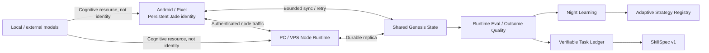

# Jade Genesis

Jade Genesis is an experimental personal AI architecture designed around one persistent logical identity that can operate across Android, PC and VPS nodes.

The project is **not** intended to make a single LLM the identity or permanent "brain" of Jade. Language and vision models are treated as interchangeable cognitive resources. The long-term goal is to let Jade accumulate structured experience, evaluate outcomes, consolidate learning signals, retain reusable strategies/skills and progressively acquire capabilities under explicit safety boundaries.

> Current Android product version: **0.1.19** (`versionCode 36`)
>
> Current dependency-free Node Runtime version: **0.1.6** / protocol `jade-genesis-node/0.0.6`
>
> Status: **experimental / personal research project**. Jade does not yet autonomously synthesize and execute new skills.

## What exists today

The repository already contains working foundations for:

- persistent Jade identity on Android;
- structured local memory and device/self profiling;
- authenticated distributed Node Runtime for PC/VPS;
- bounded task routing and cognitive brain profiles;
- Shared Genesis State replication with offline/retry behavior;
- Runtime Evaluation and Outcome Quality signals;
- VPS-supervised Night Cycle and Night Learning;
- a persistent Adaptive Strategy Registry;
- a Verifiable Task Ledger with hidden `SEALED_TEST` partitions;
- `SkillSpec v1`, a declarative contract for future executable skills;
- GitHub Actions that compile/test Android and validate the Node Runtime.

## What does **not** exist yet

The project deliberately avoids claiming capabilities that are not implemented.

As of 0.1.19:

- generated `SkillSpec` bodies are **not executed**;
- there is no autonomous skill-synthesis loop yet;
- adaptive strategies do not automatically rewrite production code;
- Jade cannot mutate model weights by itself;
- there is no arbitrary remote shell task;
- no Night Learning result can automatically promote itself into production behavior.

The next causal milestones are intended to change this carefully: first a restricted deterministic skill interpreter, then measurable skill acquisition.

## Repository layout

```text
Jade-genesis/
├── android/                 Native Android / Pixel application (Kotlin + Compose)
├── node-agent/              Dependency-free Python runtime for PC/VPS nodes
├── docs/                    Versioned architecture and learning-substrate notes
├── .github/workflows/       Android and Node Runtime verification workflows
├── .gitignore
└── README.md
```

Historical ZIP snapshots and checked-in CI logs are not source-of-truth artifacts and should not live beside current source files.

## Architecture at a glance



A more detailed component and trust-boundary description is available in [`docs/ARCHITECTURE_OVERVIEW.md`](docs/ARCHITECTURE_OVERVIEW.md).

## Learning trajectory

Jade's current learning-related path is intentionally split into evidence, governance and future executable capability:

```text
experience
  -> outcome
  -> runtime evaluation
  -> night consolidation
  -> bounded strategy candidate
  -> durable adaptive registry
  -> verifiable task evidence
  -> SkillSpec contract
  -> [future] restricted execution
  -> [future] machine evaluation
  -> [future] retention / rejection / reuse
```

Important distinction: 0.1.18 and 0.1.19 provide **adaptive-learning infrastructure and verification substrate**, not proof that Jade already learns arbitrary new behavior.

Relevant design notes:

- [`docs/ADAPTIVE_STRATEGY_REGISTRY_0.1.18.md`](docs/ADAPTIVE_STRATEGY_REGISTRY_0.1.18.md)
- [`docs/VERIFIABLE_TASK_LEDGER_SKILLSPEC_0.1.19.md`](docs/VERIFIABLE_TASK_LEDGER_SKILLSPEC_0.1.19.md)
- [`docs/OUTCOME_NIGHT_LEARNING_0.1.17.md`](docs/OUTCOME_NIGHT_LEARNING_0.1.17.md)
- [`docs/OUTCOME_RUNTIME_MEMORY_HEALTH_0.1.16.md`](docs/OUTCOME_RUNTIME_MEMORY_HEALTH_0.1.16.md)

## Android

The Android application is native Kotlin/Jetpack Compose and currently uses:

- JDK 17;
- Gradle 9.6.0;
- Android Gradle Plugin 9.4.0;
- compileSdk / targetSdk 37;
- minSdk 31;
- application ID `com.jadegenesis.mobile`.

See [`android/README.md`](android/README.md) for the current Android responsibilities and local setup.

### Reproduce the CI Android build

The canonical CI workflow installs Gradle 9.6.0, Android API 37 and Build Tools 36.0.0, then runs:

```bash
gradle --no-daemon --stacktrace --console=plain -p android \
  :app:testDebugUnitTest \
  :app:assembleDebug \
  :app:assembleRelease
```

The lightweight `android/gradlew` and `gradlew.bat` scripts currently do **not** bundle the Gradle wrapper JAR. For a local build, use Android Studio or a local Gradle 9.6.0 installation matching CI. Bundling a complete Gradle wrapper is a future reproducibility improvement.

Regular CI must not receive the stable signing keystore. Normal release APKs built in CI are therefore unsigned; the stable-release workflow is a separate explicit path.

## PC / VPS Node Runtime

The Node Runtime is Python and dependency-free. It is **not Node.js** despite the directory name `node-agent`.

From `node-agent/`:

```bash
python3 jade_node_agent.py --node-kind VPS
```

On Windows:

```powershell
py jade_node_agent.py
```

Runtime configuration is stored under `~/.jade-genesis/` (or `%USERPROFILE%\.jade-genesis\` on Windows). Pairing secrets are not intended to be committed to the repository.

See [`node-agent/README.md`](node-agent/README.md) for endpoints, brain profiles, Shared Genesis State and Night Cycle behavior.

## Security boundaries

Current design rules include:

- one identity-bound distributed state rather than a VPS-owned identity;
- authenticated node traffic;
- no arbitrary remotely invokable shell command;
- Night Learning is not exposed as a remote task;
- generated skills are non-executable in 0.1.19;
- future skill bodies use a restricted declarative DSL contract rather than arbitrary Python/shell;
- sealed verification data is separated from learning-visible examples;
- automatic promotion, production-code rewrite and model-weight mutation are disabled;
- Android validates dangerous learning flags fail-closed;
- stable signing secrets must stay outside source control and ordinary CI.

These are architectural boundaries, not a claim that the project has completed an independent security audit.

## CI and source of truth

The **Git repository is the source of truth**. Do not use old ZIP snapshots as development inputs.

Two workflows currently validate the repository:

- `.github/workflows/jade-android-ci.yml` — unit tests, debug/release builds, reproducible evaluation, APK checks and explicit stable-release mode;
- `.github/workflows/jade-node-runtime-ci.yml` — Python compile/tests and runtime/learning-substrate safety assertions.

A change is not considered verified merely because a check is green: release validation should also confirm the exact commit, product version, package, debug flag, signing identity when applicable, evaluation results and unchanged tracked sources.

## Versioning and distribution

Android versions are defined in `android/app/build.gradle.kts`.

At the time of this README update, the repository has **no formal GitHub Releases published yet**. Stable signed builds can be produced by the explicit stable-release GitHub Actions path, but long-term distribution should link:

```text
version -> Git tag -> exact source commit -> successful CI -> signed artifact -> SHA-256
```

Generated APK/ZIP artifacts belong in GitHub Actions artifacts or GitHub Releases, not committed at the repository root.

## Roadmap

Near-term architecture milestones:

- **0.1.19 — Verifiable Task Ledger + SkillSpec:** machine-verifiable datasets and a safe declarative skill contract. Implemented.
- **0.1.20 — Restricted Procedure Runtime:** execute manually authored `JADE_PROCEDURE_DSL_V1` skills in a deterministic, bounded interpreter and connect selection -> execution -> verdict.
- **0.1.21 — Skill Synthesis Loop:** detect a capability gap, request/generate a candidate skill, test it against visible and sealed cases, retain/reject it, restart Jade and prove reuse without manually writing the learned skill body.
- **0.1.22+ — Recall, coverage, pruning, composition and generalisation:** make retained skills easier to discover, combine and maintain without turning the registry into a collection of one-off rules.

The first strong learning proof should be measurable: Jade must acquire a previously absent deterministic capability, persist it, survive restart and reuse it successfully on unseen cases without another model call for execution.

## License

No software license has been selected yet. The repository is public, but public visibility alone does **not** grant open-source reuse rights. A license should be chosen explicitly before presenting Jade Genesis as an open-source project or inviting third-party redistribution.

## Project status

Jade Genesis is under active development. Documentation describes implemented behavior where possible and explicitly marks future behavior as future work. When documentation and code disagree, the exact source commit and its passing CI are authoritative.
