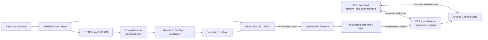

# Jade Genesis

Jade Genesis is an experimental personal AI architecture built around one persistent logical identity that can operate across Android, PC and VPS nodes.

The project is **not** designed around one permanent LLM as Jade's identity or central brain. Local and external language/vision models remain interchangeable cognitive resources. The long-term goal is for Jade to accumulate structured experience, measure outcomes, consolidate useful evidence and acquire reusable bounded capabilities under explicit safety boundaries.

> Current Android product version on this branch: **0.1.21** (`versionCode 39`)
>
> Current dependency-free Node Runtime version: **0.1.8** / protocol `jade-genesis-node/0.0.6`
>
> Status: **experimental / personal research project**. The 0.1.21 mechanism for verified procedural acquisition is implemented and tested in CI. The decisive live VPS/Pixel restart-and-reuse proof is still required before claiming that Jade has demonstrated persistent acquisition in production.

## What exists today

Working foundations now include:

- persistent Jade identity and local structured memory on Android;
- device profiling, self-model and authenticated PC/VPS nodes;
- bounded task routing and cognitive brain profiles;
- Shared Genesis State with offline/retry behavior;
- Runtime Evaluation and explicit outcome evidence;
- supervised VPS Night Cycle / Night Learning;
- Adaptive Strategy Registry;
- Verifiable Task Ledger with TRAIN, VALIDATION and hidden `SEALED_TEST`;
- `SkillSpec v1` and the bounded `JADE_PROCEDURE_DSL_V1`;
- deterministic restricted procedure execution;
- physically separated production / workshop / archive learning zones;
- immutable sealed case packs and a hash-chained attribution journal;
- verified learned-Skill registration gated by an exact hidden-exam proof;
- bounded Ollama CODE-profile teacher integration;
- measured exact-family Skill reuse before Ollama;
- one deliberately narrow real-traffic family, `normalize_label_v1`;
- Android `/normalize <text>` plumbing to send genuine Pixel traffic to the VPS workshop;
- GitHub Actions that compile/test Android and validate the Node learning boundaries.

## What 0.1.21 is trying to prove

The milestone is not successful merely because a generated Skill reaches `RETAINED`.

The required causal proof is:

```text
no target Skill
-> real Pixel usage
-> fixed partitions + sealed datasets
-> hashes published before teacher
-> teacher sees TRAIN/VALIDATION only
-> candidate frozen
-> one-shot hidden exam
-> exact verified Skill retained and routed
-> hard Node Runtime restart
-> genuinely new real Pixel input
-> retained Skill selected automatically
-> measured Ollama call delta = 0
-> negative control: deactivate Skill and model calls return
```

That sequence distinguishes “a procedure passed a test” from “Jade acquired a persistent capability that changes future behavior.”

See [`docs/SKILL_SYNTHESIS_LOOP_0.1.21.md`](docs/SKILL_SYNTHESIS_LOOP_0.1.21.md).

## First real family

The first family is intentionally boring and objectively verifiable:

`normalize_label_v1`

It maps a label to the same label trimmed and lower-cased. On Android, only the explicit command:

```text
/normalize <text>
```

is marked `REAL_USER` and allowed to feed this experiment. Ordinary chat is not enrolled.

These commands are routed specifically to the VPS workshop rather than normal generative hardware scoring, so evidence, hidden tests and retained Skills live in the canonical always-on learning environment.

Every five unique real inputs complete one dataset with a partition plan fixed before teaching:

```text
TRAIN, TRAIN, VALIDATION, SEALED_TEST, SEALED_TEST
```

The fifth case seals the dataset. The Pixel then displays only the dataset ID and `sealed_set_sha256`, which can be published externally before the teacher is enabled. Hidden inputs, hidden answers and the private seal nonce remain undisclosed.

At least **three** independently sealed, externally attested and unconsumed datasets are required before the teacher may run. One failed final candidate therefore burns one hidden exam without creating pressure to unseal or recycle it.

## Author / judge separation

The 0.1.21 teacher is a proposal source, not the judge.

`OllamaSkillTeacher` receives visible TRAIN/VALIDATION evidence and can return only:

```text
skill_id
description
domain
body
```

Jade constructs provenance, verifier policy, dependencies and the exact hidden-set commitment itself. The teacher cannot choose activation or verdict.

The Verifiable Task Ledger owns the final exam. Individual `SEALED_TEST` cases cannot be queried through the normal evaluator. The complete hidden set is executed internally and only aggregate PASS/FAIL is returned. The first final candidate consumes that dataset even on failure.

## Three-zone learning environment

0.1.21 separates failure-prone experimentation from production:

```text
production/
  skill-routes.json

workshop/
  skill-learning-goals.json
  candidates/

archive/
  skill-registry.json
  verifiable-task-ledger.json
  case-packs/
  skill-attribution.jsonl
```

Production contains route references only, not Skill bodies or hidden expected answers. Workshop state is disposable. Archive contains retained artifacts, verifier evidence and append-only attribution.

The attribution journal is SHA-256 chained. Usage and measured gain are derived from events instead of trusting one mutable counter.

## Restricted execution

Learned procedures remain inside `JADE_PROCEDURE_DSL_V1`. There is no DSL primitive for arbitrary Python, shell/process execution, filesystem, network, imports/eval/exec, environment variables, clock or randomness. Skill-to-Skill dependencies remain disabled.

The runtime enforces AST/value/output limits plus deterministic logical step and cost budgets. This is a restricted interpreter, not an OS/container sandbox for arbitrary native code.

## Measured model bypass

The Node Runtime wraps the actual Ollama model-list path and `/api/chat` path with process-local counters. Exact-family Skill lookup occurs immediately before the profiled Ollama call.

For the formal proof, the post-restart request must show a real `ollama_calls_delta = 0`. Latency is not accepted as a proxy. The negative control must remove the active route and show that a comparable request causes counted model access again.

The current Skill lookup is intentionally placed inside Node `brain_chat` for the cheapest proof. Android has already selected a node and acquired a Resource Lease at that point. Moving Skill dispatch upward into the task router is explicit post-proof debt.

## Night-cycle crank

The existing VPS Night Cycle now has one narrow 0.1.21 Skill-learning phase. It remains inert unless `learning_trial_enabled` is explicitly enabled.

Before a teacher call, it requires Jade's identity, an uncovered exact family, at least three attested sealed datasets, and attestation records matching the exact commitments. It then opens the goal and delegates proposal, visible evaluation, final exam and retention to the existing bounded components.

No arbitrary remote `skill_learn`, `skill_synthesis`, `sealed_skill_exam`, registry-mutation or procedure-execution task is exposed.

## Important limits

Jade must not yet be confused with autonomous general intelligence or unrestricted self-improvement.

- 0.1.21 learns one bounded procedural family, not arbitrary tasks;
- the final live hard-restart proof has not yet been completed on the real VPS/Pixel path;
- fuzzy Skill retrieval and broad confidence-based recall are not implemented;
- Skill-to-Skill composition is disabled;
- learned Skills cannot access shell/filesystem/network primitives;
- model weights are not trained or mutated;
- the Android Evolution Engine remains separate and does not autonomously rewrite production code;
- the phone/VPS integration still depends on available authenticated nodes and cognitive backends.

## Architecture at a glance



Detailed architecture: [`docs/ARCHITECTURE_OVERVIEW.md`](docs/ARCHITECTURE_OVERVIEW.md).

## Version trajectory

- **0.1.19 — Verifiable Task Ledger + SkillSpec:** deterministic datasets and declarative procedure payload. Implemented.
- **0.1.20 — Restricted Procedure Runtime:** deterministic DSL interpreter, developer Skill Registry and one-shot hidden final exam. Implemented.
- **0.1.20.1 — Cognitive Plumbing Hardening:** durable memory delivery, lifecycle cleanup, Shared State compaction and meaningful Evolution metrics. Implemented on `main`.
- **0.1.21 — Verified Skill Synthesis Loop:** three-zone environment, bounded teacher, dataset reserve/attestation, Night Cycle crank, measured Skill reuse and Pixel real-traffic path. Mechanism implemented on this branch; live restart proof pending.
- **0.1.22 — Retrieval/lifecycle quality:** only after 0.1.21's live proof; multiple-skill selection, confidence, abstention, regression/rollback and maintenance.
- **0.1.23+ — Composition/generalisation:** controlled composition after the single-Skill causal model is proven.

## Android / Node build versions

Android uses Kotlin/Compose with JDK 17, Gradle 9.6.0, AGP 9.4.0, compile/target SDK 37 and minSdk 31. See [`android/README.md`](android/README.md).

The Node Runtime is dependency-free Python despite the historical directory name `node-agent`. See [`node-agent/README.md`](node-agent/README.md).

Ordinary Android CI builds debug and unsigned release APKs. Stable signing is a separate explicit path; a green ordinary CI check is not evidence of stable signing.

## Repository layout

```text
Jade-genesis/
├── android/
├── node-agent/
├── docs/
├── .github/workflows/
├── .gitignore
└── README.md
```

The Git repository is the canonical source of truth. Generated APKs, logs and evaluation artifacts belong in Actions/release artifacts rather than the source tree.

## License

No software license has been selected yet. The repository is public, but public visibility alone does **not** grant open-source reuse or redistribution rights. A formal license/usage decision remains to be made.

## Project status

Jade Genesis is under active development. Documentation is updated with meaningful milestones. If documentation and code disagree, the exact source commit and verified implementation take precedence.
